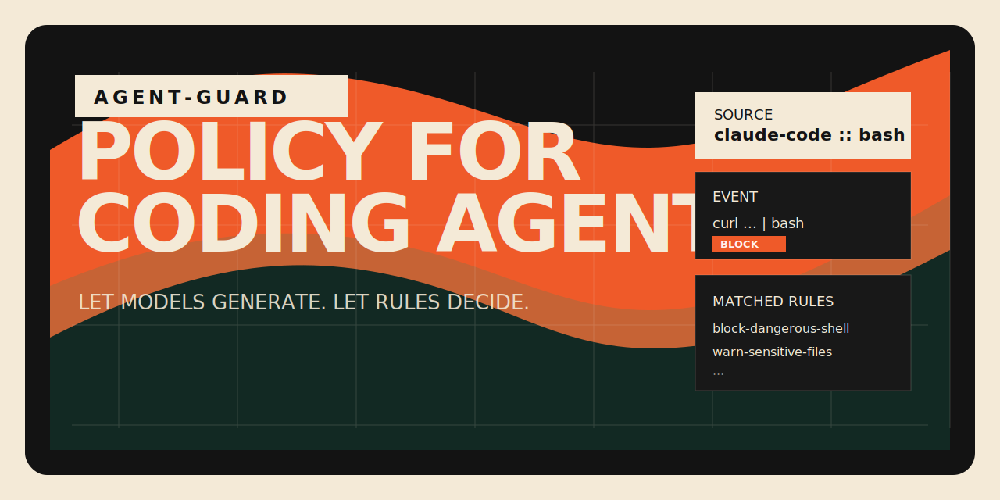

# agent-guard



Programmable guardrails for coding agents across Claude Code, Codex, Cursor, MCP, and CI.

GitHub repo branding uses `agent-guard`. The publishable npm package name is `agent-guard-cli`, because the unscoped `agent-guard` package name is already taken on npm as of April 3, 2026.

`agent-guard` is a standalone policy layer for agentic coding. You feed it a normalized event, it evaluates that event against a rule pack, and it returns a deterministic decision:

- `allow`
- `warn`
- `block`

This is useful when you want models to generate code quickly, but you do **not** want the model itself to be the only line of defense before it:

- runs a destructive shell command
- edits a secret-bearing file
- touches production MCP tools
- emits a huge generated patch that should have human review

## What problem this solves

Most coding-agent stacks have the same structural gap:

1. A runtime emits some tool call, file write, prompt, or MCP request.
2. The model decides what to do.
3. The system executes it.

What is usually missing is an explicit policy layer between step 2 and step 3.

`agent-guard` is that missing layer.

You can put it:

- inside a Claude Code hook chain
- inside a Codex wrapper script
- inside GitHub Actions before applying generated changes
- inside an MCP gateway before allowing access to production servers

It gives you a stable contract:

- one normalized event format
- one portable rule format
- one explicit decision format

## How it works

```text
Runtime payload -> Adapter -> agent-guard -> Decision

Claude Code hook ----\
Codex wrapper --------> normalize to JSON event -> evaluate rules -> allow/warn/block
GitHub Actions -------/
MCP gateway ----------/
```

At the center is a tiny rule engine that matches fields like:

- `toolName`
- `command`
- `filePath`
- `content`
- `prompt`
- `mcpServer`
- `mcpTool`
- `tags`
- `metadata.*`

## Features

- standalone TypeScript CLI
- YAML or JSON rule packs
- generic event model for `prompt`, `tool_call`, `file_write`, `mcp_call`, `stop`, and `session`
- `allow`, `warn`, and `block` decisions
- recursive rule loading from a single file or a directory
- baseline preset for common coding-agent risks
- first-party GitHub Action wrapper
- runnable Claude Code and Codex adapter examples
- static landing page ready for GitHub Pages or Netlify

## Quick start

```bash
npm install
npm run build
node dist/src/cli/main.js validate --rules presets/baseline.yml
node dist/src/cli/main.js eval --rules presets/baseline.yml --input examples/dangerous-command.json
```

You can scaffold a local rule directory too:

```bash
node dist/src/cli/main.js init --preset baseline --dir .agent-guard
```

## CLI

### Validate rules

```bash
agent-guard validate --rules presets/baseline.yml
```

### Evaluate an event

```bash
agent-guard eval \
  --rules presets/baseline.yml \
  --input examples/sensitive-file-edit.json \
  --format pretty
```

### Fail CI on warnings too

```bash
agent-guard eval \
  --rules presets/baseline.yml \
  --input examples/sensitive-file-edit.json \
  --fail-on-warn
```

Exit codes:

- `0`: allow or warn
- `2`: block, or warn when `--fail-on-warn` is set
- `1`: CLI/config/runtime error

## Event format

The core engine consumes a normalized JSON event:

```json
{
  "kind": "tool_call",
  "source": "claude-code",
  "toolName": "bash",
  "command": "rm -rf /",
  "metadata": {
    "cwd": "/tmp/demo"
  }
}
```

Useful top-level fields:

- `kind`: `prompt`, `tool_call`, `file_write`, `mcp_call`, `stop`, `session`
- `source`: `claude-code`, `codex`, `cursor`, `github-actions`, or any custom label
- `toolName`, `command`
- `filePath`, `content`
- `mcpServer`, `mcpTool`
- `prompt`, `transcript`
- `tags`
- `metadata.*` for custom adapter-specific context

## Rule format

Rules can live in a single file or a directory.

```yaml
rules:
  - id: block-dangerous-shell
    appliesTo:
      - tool_call
    action: block
    priority: 100
    message: Dangerous shell command detected.
    match:
      all:
        - field: toolName
          operator: equals
          value: bash
          ignoreCase: true
        - field: command
          operator: regex
          value: "(rm\\s+-rf\\s+/|curl\\s+.*\\|\\s*(sh|bash))"
```

Supported operators:

- `equals`
- `not_equals`
- `contains`
- `not_contains`
- `starts_with`
- `ends_with`
- `regex`
- `in`
- `not_in`
- `exists`
- `not_exists`

Fields support dot notation, for example `metadata.changedLines`.

## Baseline preset

The included [baseline.yml](/Users/arc/iCloud/Documents/macbook/project/claude-code-main/agent-guard/presets/baseline.yml) covers four common policies:

- block destructive shell commands
- warn on sensitive file paths and likely secret content
- block production MCP access without an approval tag
- warn on very large generated patches

## GitHub Action

This repository now ships a first-party published JavaScript action at [action.yml](/Users/arc/iCloud/Documents/macbook/project/claude-code-main/agent-guard/action.yml).

### Usage

```yaml
- uses: your-org/agent-guard@v0
  id: guard
  with:
    rules: presets/baseline.yml
    input: .agent-guard/events/normalized.json
    fail_on_warn: false
```

### Outputs

- `decision`
- `summary`
- `matched-rule-ids`
- `result-json`

There is also a ready-to-copy example workflow at [evaluate-agent-event.yml](/Users/arc/iCloud/Documents/macbook/project/claude-code-main/agent-guard/examples/github-actions/evaluate-agent-event.yml).

The action is now release-oriented:

- no `npm ci` during workflow execution
- no runtime TypeScript compilation
- bundled entrypoint at `dist/action/index.cjs`
- fixed `node20` JavaScript action runtime

## Adapters

The included adapters show how to translate runtime-specific payloads into the normalized `agent-guard` event format.

### Claude Code adapter example

```bash
node adapters/claude-code/normalize-event.mjs \
  examples/adapters/claude-code-hook.json \
  .agent-guard/events/claude-code.json

node dist/src/cli/main.js eval \
  --rules presets/baseline.yml \
  --input .agent-guard/events/claude-code.json
```

### Codex adapter example

```bash
node adapters/codex/normalize-event.mjs \
  examples/adapters/codex-wrapper-event.json \
  .agent-guard/events/codex.json

node dist/src/cli/main.js eval \
  --rules presets/baseline.yml \
  --input .agent-guard/events/codex.json
```

See [adapters/README.md](/Users/arc/iCloud/Documents/macbook/project/claude-code-main/agent-guard/adapters/README.md) for the adapter rationale.

## Landing page

A deployable static site lives in [site/index.html](/Users/arc/iCloud/Documents/macbook/project/claude-code-main/agent-guard/site/index.html).

Run it locally:

```bash
npm run site:serve
```

Then open [http://localhost:4173](http://localhost:4173).

GitHub Pages deployment is scaffolded in [pages.yml](/Users/arc/iCloud/Documents/macbook/project/claude-code-main/agent-guard/.github/workflows/pages.yml).

## Release automation

Release automation is scaffolded in:

- [ci.yml](/Users/arc/iCloud/Documents/macbook/project/claude-code-main/agent-guard/.github/workflows/ci.yml)
- [release.yml](/Users/arc/iCloud/Documents/macbook/project/claude-code-main/agent-guard/.github/workflows/release.yml)
- [pages.yml](/Users/arc/iCloud/Documents/macbook/project/claude-code-main/agent-guard/.github/workflows/pages.yml)

The release workflow is set up for:

- running tests on release tags
- verifying the bundled Action artifact is committed
- producing an npm tarball
- publishing to npm with provenance
- creating a GitHub Release with the tarball and banner attached

To use it, you need an `NPM_TOKEN` repository secret and a pushed tag like `v0.1.0`.

## Demo flow

Demo assets and scripts live in [demo/README.md](/Users/arc/iCloud/Documents/macbook/project/claude-code-main/agent-guard/demo/README.md).

Quick demo:

```bash
npm run demo:run
```

Prepared JSON outputs for videos or screenshots:

```bash
npm run demo:prepare
```

## Project structure

```text
agent-guard/
├── action.yml
├── adapters/
├── examples/
├── presets/
├── site/
├── src/
└── test/
```

## Development

```bash
npm install
npm test
```

## Suggested roadmap

Good next layers if you want this repo to grow:

- Cursor adapter and example payloads
- remote signed rule packs
- MCP proxy mode
- rule tracing and explainability output
- SARIF or PR-comment output for CI review workflows

## Launch assets

Branding and launch copy live in [LAUNCH.md](/Users/arc/iCloud/Documents/macbook/project/claude-code-main/agent-guard/LAUNCH.md).
